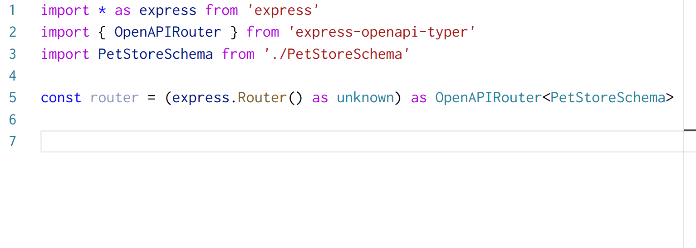

# express-openapi-typer
 [](https://badge.fury.io/js/express-openapi-typer)

## Caution! Alpha-level software ahead. Use at your own peril
Code-generation-free conversion of **OpenAPI v3.1** schema into **type-checked Express request handlers**.

Derive Express handler types from an OpenAPI schema to get
- type errors when a handler doesn't match the schema, and
- auto-completion on handler path, `req.param`, `req.query`, `req.body`, `res.send()`, `res.json()` etc.

Note that the library **does not perform runtime validation** against the OpenAPI schema: add something like https://github.com/Hilzu/express-openapi-validate for that purpose.

**Requires OpenAPI v3.1**. This library relies heavily on existing JSON Schema tooling whereas earlier OpenAPI versions use the [OpenAPI Schema Object](https://github.com/OAI/OpenAPI-Specification/blob/master/versions/3.0.0.md#schemaObject) instead of pure JSON Schema. OpenAPI `v3.1` is yet unpublished; track progress [here](https://github.com/OAI/OpenAPI-Specification/issues/2025). Read more about the OpenAPI/JSON Schema divergence at https://apisyouwonthate.com/blog/openapi-and-json-schema-divergence-part-1 and how `v3.1` solves it at https://phil.tech/2019/09/07/update-openapi-json-schema/.

## Install

`yarn add express-openapi-typer`

## Usage

First define your OpenAPI schema as a TypeScript type:

```typescript
interface PetStoreSchema {
  openapi: '3.1.0'
  info: { ... }
  paths: {
    '/pets': {
        get: { ...}
    },
    ...
  }
}
```

Then override your Express router's type from

```typescript
const router = express.Router()
```

into the following:

```typescript
import { OpenAPIRouter } from 'express-openapi-typer'

const router = (express.Router() as unknown) as OpenAPIRouter<PetStoreSchema>
```

Handler functions in `router` now get type-checked as per `PetStoreSchema`! For example when using [the full sample PetStore schema](https://github.com/OAI/OpenAPI-Specification/blob/master/examples/v3.0/petstore-expanded.yaml) we end up with the following:



### Access OpenAPI schema type from a runtime value

It can be useful to instantiate the OpenAPI schema as a runtime value instead of just defining a type. For example when serving the schema as documentation or handling validation we need to access the schema at runtime. In cases like these combine `typeof` and [`as const`](https://www.typescriptlang.org/docs/handbook/release-notes/typescript-3-4.html#const-assertions) to access the schema value's type:

```typescript
const petStoreSchema = {
  openapi: '3.1.0',
  info: { ... },
  paths: {
    '/pets': {
        get: { ... }
    },
    ...
  }
} as const // <-- important!

type PetStoreSchema = typeof petStoreSchema
```

### Allow additional paths

By default `OpenAPIRouter` doesn't allow any additional handlers not defined in the OpenAPI schema. To loosen this restriction you can expand the type as follows:

```typescript
import * as express from 'express'

const router = express.Router() as OpenAPIRouter<PetStoreSchema> & express.Router
```

You can also select a subset of `express.Router` with [`Pick`/`Omit`](https://www.typescriptlang.org/docs/handbook/utility-types.html#picktk) when allowing additional methods only for a specific HTTP method, for example.

## TODO
- All the limitations from [`json-schema-type-mapper`](https://github.com/epiphone/json-schema-type-mapper) apply here as well
- Handle request header parameters?
- API client type checking, using Axios?
- Figure a way out of the unfortunate `as unknown` cast
- Support path-based `$ref`s, not just `$id`-based ones
  - requires some sort of manual mapping as we can't take `"#/components/schemas/NewUser"` apart at type-level

## Related projects
- Check out [restyped](https://github.com/rawrmaan/restyped) and [rest.ts](https://github.com/hmil/rest.ts) for different approaches to type-safe REST APIs
